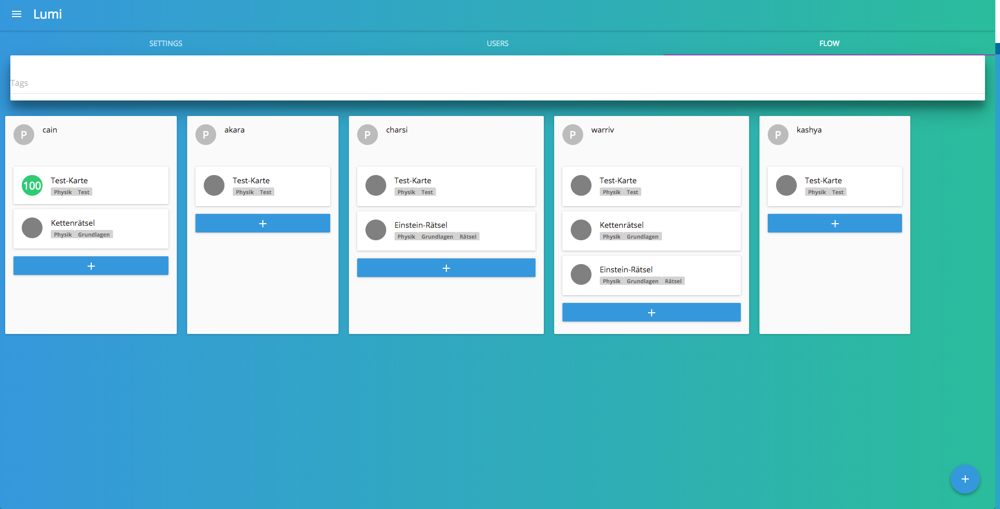

# Lumi

Lumi is a single-page web application that allows teachers to create and share content with their students and monitor their progress. Lumi is builtfor providing blended learning-tools in environments with weak infrastructure.



It’s built with TypeScript – a [node](https://nodejs.org/) plus [express](https://expressjs.com/) and [socket.io](http://socket.io) server, [React.js](https://reactjs.org/), [Redux](https://redux.js.org/) and [Material-ui](https://www.material-ui.com).
It runs as a [Docker](https://docker.com)-container on a [Raspberry Pi 3](https://www.raspberrypi.org) or as a [Electron](https://electronjs.org)-Standalone App on Mac OS X, Windows and Linux.

## Getting started

These instructions will get you a copy of Lumi up and running on your local machine for development and testing purposes.

### Prerequisites

Make sure you have [`git`](https://git-scm.com/), [`node`](https://nodejs.org/), and [`npm`](https://www.npmjs.com/get-npm) installed.

### Installing

```
$ git clone https://github.com/Lumieducation/Lumi
$ cd Lumi
$ npm install
$ npm start
```

Open `http://localhost:8080` in your browser.

## Documentation

You can find a documentation about what Lumi is and how it works on [http://docs.Lumi.education](http://docs.Lumi.education)

## Contributing

Lumi tries to improve education wherever it is possible by providing a software that connects teachers with their students. But Lumi is in a very early development stage. Every help is appreciated and welcome. You can contribute in many ways. You can help reporting, testing, and detailing bugs, and also test and suggest new features or help write the [documentation](http://docs.Lumi.education).
Please read [CONTRIBUTING.md](./.github/CONTRIBUTING.md) for details on our code of conduct, and the process for submitting pull requests to us.

Lumi has adopted the code of conduct defined by the Contributor Covenant. It can be read in full [here](./CODE-OF-CONDUCT.md).

### Get in touch

[Slack](https://join.slack.com/t/lumi-education/shared_invite/enQtMjY0MTM2NjIwNDU0LWU3YzVhZjdkNGFjZGE1YThjNzBiMmJjY2I2ODk2MzAzNDE3YzI0MmFkOTdmZWZhOTBmY2RjOTc3ZmZmOWMxY2U) or [c@Lumi.education](mailto:c@Lumi.education).

## Versioning

We use [SemVer](http://semver.org/) for versioning. For the versions available, see the [tags on this repository](https://github.com/Lumieducation/Lumi/tags).

## License

This project is licensed under the GNU AFFERO GENERAL PUBLIC LICENSE v3 License - see the [LICENSE](LICENSE) file for details
