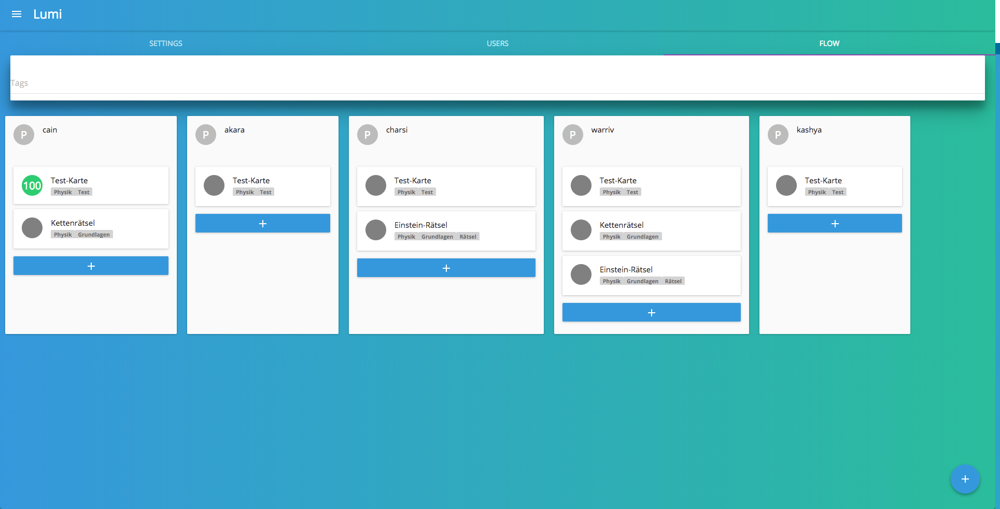

# Lumi

Lumi ist eine Software und Sammlung von digitalen Werkzeugen, die auf einem Laptop oder Router läuft und den unterrichtsbezogenen Einsatz von Smartphones ohne Internetverbindung ermöglicht.

## Motivation

Lumi entstand durch den Wunsch in Schulen mit schlechter IT-Infrastruktur digitale Medien einzusetzen und die große Abdeckung von Smartphones in der Schülerschaft zu nutzen und somit zeitgemäße Bildung für alle zu ermöglichen.

## Was bietet Lumi?

### Digitale Inhalte erstellen

Die Lehrkraft kann mit Hilfe von Lumi digitale Inhalte erstellen. Lumi bietet eine Vielzahl möglicher Inhalts-Typen. So können von Multiplechoice-Fragen über Videos bis hin zu Foto-Upload-Aufgaben alle Möglichen Aufgabenformate abgedeckt werden.

### Überwachung des Lernfortschritts

Lumi bietet der Lehrkraft die Möglichkeit, während des Unterrichts, den Lernfortschritt der gesamten Klasse zu visualisieren und individuell auf einzelne Lerner einzugehen.

### Analyse des Lernfortschritts

Lumi bietet eine detaillierte Analyse über individuelle Lernprozesse und erlernte Kompetenzen, so kann die Lehrkraft den Unterricht an jeden Lerner anpassen und individualisieren. Binnendifferenzierung war gestern - Individualiserung ist heute.

## Wie funktioniert Lumi?

Moderne Laptops haben die Möglichkeit ihren eingebauten WLAN-Chip als Access-Point zu öffnen - die Lehrkraft öffnet ein lokales WLAN-Netzwerk. Die Lernenden können sich mit ihrem Smartphone mit dem Access-Point der Lehrkraft verbinden, wodruch sich alle Geräte im selben Netzwerk befinden. Lumi startet einen Webserver und stellt diesen über das Netzwerk zur Verfügung. Die Lernenden können über ihren Webbrowser auf den Webserver zugreifen und die Inhalte abrufen, Dateien hochladen oder andere Werkzeuge benutzen.

Lumi läuft auch auf Einplatinencomputern, wodruch sich beispielsweise ein Raspberry Pi in ein Lumi-Server verwandeln lässt.

## Vorteile im Überblick

-   Die Lehrkraft hat schnelle Rückmeldung über den Lernfortschritt der Klasse.
-   Die Lehrkraft wird unabhängig von bestehenden IT-Infrastrukturen.
-   Alle Daten bleiben dort, wo sie hingehören - im Klassenzimmer.
-   Die Lernenden müssen keine App installieren - lediglich eine Webseite aufrufen.
-   Durch den Einsatz der privaten Smartphones der Schüler (Bring your own device) entfällt für die Schule auch ein aufwendiges Warten von Geräten.
-   Geschlossene Aufgabenformate werden automatisch ausgewertet: weniger Korrekturzeit.
-   Jedes Smartphone, Tablet oder Laptop wird zu einer digitalen Lernstation: Keine Wartung von Schulgeräten.
