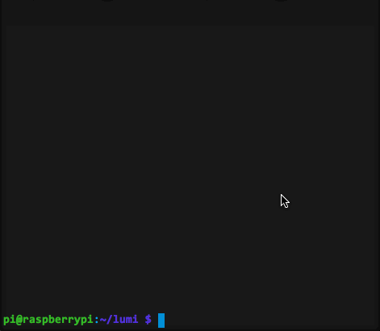

# Update

### Automatische Updates

Lumi wird [demnächst](https://github.com/Lumi-education/Lumi/issues/120) mit einer Auto-Update-Funktion ausgestattet, die automatisch alle 10 Minuten nach Updates sucht, solange die Lumi mit dem Internet verbunden ist.

### Manuelles Update

1. Per ssh mit dem Raspberry Pi verbinden.
2. In den Lumi-Ordner wechseln. Meist ist dieser `/home/pi/lumi`. (`$ cd /home/pi/lumi`)
3. Aktuelle Docker-images herunterladen:

```bash
$ sudo docker-compose pull
```

4. Lumi über Docker neustarten:

```bash
$ sudo docker-compose up -d
```


