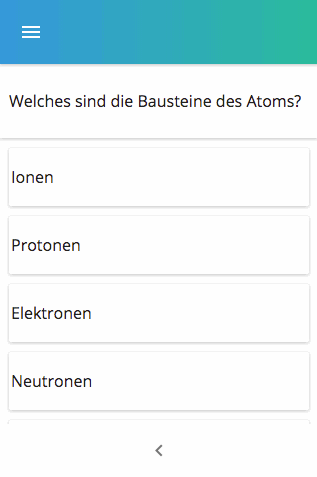

# Features

Liste an Features. Wünsche/Ideen/Anregungen bitte an [c@lumi.education](mailto:c@lumi.education) oder unter [forum.Lumi.education](http://forum.Lumi.education) anmelden.

## Offline-Modus und Netzwerkverbindung

Lumi ist für Umgebungen mit schlechter IT-Infrastruktur konzipiert. Sollte ein Lerner einmal die Verbindung zur LumiBox verlieren, so geht Lumi in den Offline-Modus. Der Offline-Modus wird durch eine rot/gelb Färbung in der oberen Leiste angezeigt. Im Offline-Modus können Multiplechoice und Freitext-Aufgaben weiter bearbeitet werden. Die Daten werden lokal auf dem Handy gespeichert und bei wieder aufgebauter Verbindung zur LumiBox synchronisiert- so gehen keine Daten verloren.

### Achtung

Dieses Feature befindet sich momentan in der Test-Phase. Der Offline-Modus funktioniert aktuell (v0.4.0) nur mit Lumi-eigenen Formaten:

-   Multiplichoice
-   Freetext

und dort nur mit Text. Zum Laden von Bildern oder Videos muss eine Verbindung zur LumiBox bestehen.

In Zukunft werden weitere Formate wie H5P integriert.

