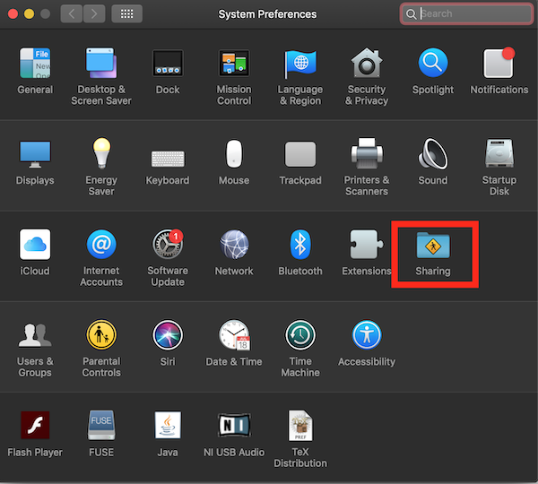
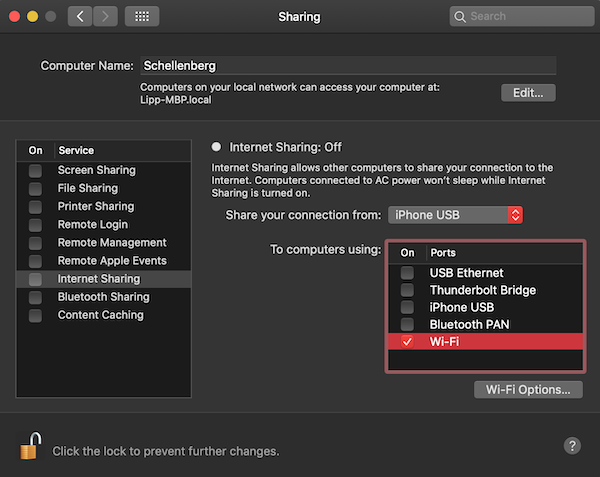
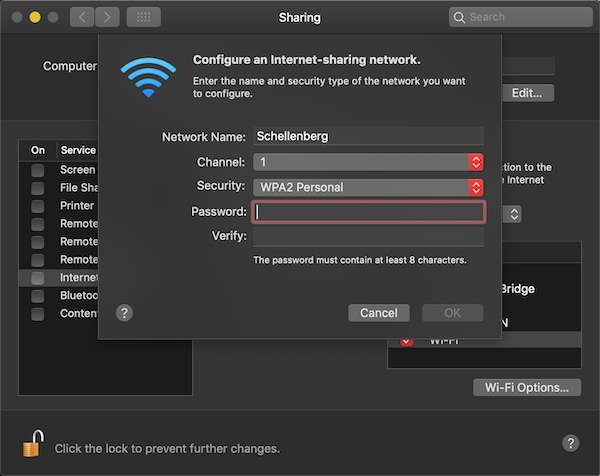
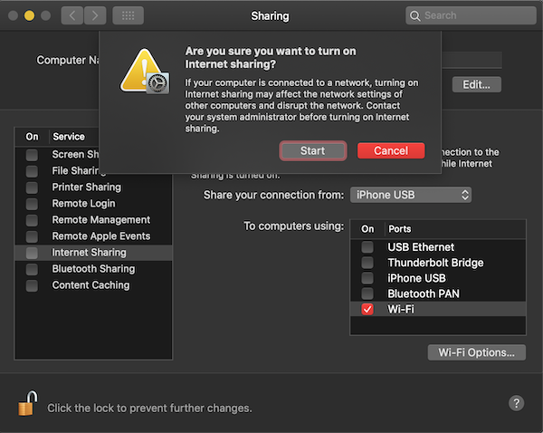
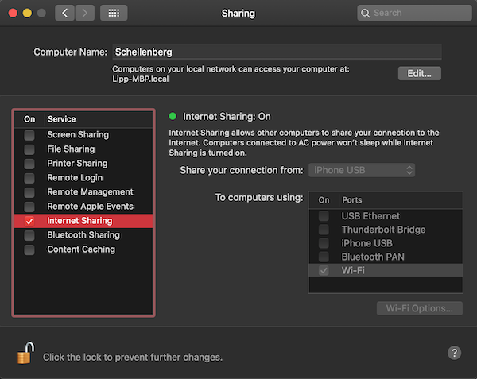

# Netzwerk öffnen auf macOS

Um ein Netzwerk unter macOS zu öffnen benötigst du ein MacBook und folgende Dinge:

-   Smartphone mit tethering-Funktion
-   Verbindungskabel für das Smartphone mit dem Macbook

    oder

-   eine Internetverbindung über Ethernet

Warum benötigst du eine Internetverbindung? - MacBooks bieten die Möglichkeit über ein lokales WLAN die Internetverbindung mit anderen Geräten zu teilen. Leider öffnen die MacBooks das lokale WLAN nur, wenn es auch eine Internetverbindung zum teilen gibt. Wir arbeiten an einer Lösung, so dass ein WLAN auch ohne Internetverbindung geöffnet werden kann. Falls du uns dabei weiterhelfen kannst, dann setze dich mit uns in [Verbindung](../kontakt.md). Bis dahin, muss also der Internetzugang deines Smartphones dabei helfen, dass Netzwerk zu öffnen.

### Internet

Du teilst über das Netzwerk die Internetverbindung deines Smartphones. Die Schüler können also _theoretisch_ ins Internet gehen. Wir arbeiten daran, dass Lumi die [Internetverbindung für Schüler blockiert](https://github.com/Lumieducation/Lumi/projects/8). _Praktisch_ werden die Schüler schnell die Lust verlieren ins Internet zu gehen, da bei mehr als 10 Schülern die Verbindung sehr langsam sein wird. Nur Lumi wird schnell laden, da es lokal auf deinem MacBook läuft.

### Netzwerk öffnen

Öffne die Systemeinstellung „Freigaben“. (Wähle dazu „Apple“ > „Systemeinstellungen“ und klicke auf „Freigaben“.)

Markiere das Feld „Internetfreigabe“ und klicke auf das Einblendmenü „Verbindung teilen“ und wähle die Internetverbindung aus, die du teilen möchtest. Bist du beispielsweise via iPhone mit dem Internet verbunden, wähle „iPhone USB“. In der Liste „Mit Computern über“ kannst du auswählen, wie du deine Internetverbindung teilen möchtest. Wähle „WLAN“.

Über den Button "WLAN Optionen" kannst du den Namen und das Passwort des Netzwerkes einstellen.

Nun setze den Haken bei "Internet Freigabe". Du wirst noch einmal gefragt, ob du dir sicher bist, dass du dein Internet teilen möchtest. Klicke auf "Start".

Du hast jetzt das Netzwerk geöffnet. Du solltest in deiner Umgebung jetzt ein WLAN mit deinem gwählten Namen finden.

Als nächstes musst du deine Schüler in das Netzwerk und zu Lumi bringen. Wie du das schaffst, erfährst du [hier](../erste-schritte.md).

[Apple Support](https://support.apple.com/kb/PH25327?locale=de_DE)
